# Intern Status Tracker

A full-stack web application for recording and tracking interns' daily work updates. Built with **FastAPI**, **PostgreSQL**, **SQLAlchemy**, and plain **HTML/CSS/JavaScript**, deployed via **Docker Compose**.

---

## Table of Contents

1. [Project Overview](#project-overview)
2. [Architecture](#architecture)
3. [Setup Instructions](#setup-instructions)
4. [API Endpoint Reference](#api-endpoint-reference)
5. [Database Design](#database-design)
6. [Assumptions & Design Decisions](#assumptions--design-decisions)

---

## Project Overview

The Intern Status Tracker lets administrators:

- **Manage candidates** — add, edit, delete, activate/deactivate
- **Record daily statuses** — each candidate submits one status per day (work done, topics learned, blockers, next-day plan, completion %)
- **View a dashboard** — see at a glance who submitted today vs who missed, average completion, and the latest status from every candidate

---

## Architecture

```
┌─────────────────────────────────────────────────────┐
│                  Docker Compose                     │
│                                                     │
│  ┌──────────┐    ┌──────────────┐    ┌───────────┐  │
│  │ Postgres │◄───│   Backend    │◄───│  Nginx    │  │
│  │ :5432    │    │  FastAPI     │    │  :80      │  │
│  │          │    │  :8000       │    │           │  │
│  └──────────┘    └──────────────┘    └───────────┘  │
│   (persistent                         (serves HTML   │
│    volume)                             + proxies     │
│                                        /api/ to      │
│                                        backend)      │
└─────────────────────────────────────────────────────┘
```

| Service    | Tech                     | Purpose                            |
|------------|--------------------------|------------------------------------|
| `postgres` | PostgreSQL 17 Alpine     | Persistent relational database     |
| `backend`  | Python 3.11 + FastAPI    | REST API, business logic, ORM      |
| `frontend` | Nginx Alpine             | Serves static HTML/JS/CSS + proxy  |

### Backend Structure

```
backend/
├── app/
│   ├── main.py               # App factory, CORS, startup
│   ├── database.py           # Engine, session, DB retry
│   ├── models.py             # SQLAlchemy ORM models
│   ├── schemas.py            # Candidate Pydantic schemas
│   ├── status_schemas.py     # DailyStatus Pydantic schemas
│   ├── statistics_schemas.py # Dashboard/statistics schemas
│   ├── summary_schemas.py    # Candidate summary schema
│   ├── candidate_routes.py   # /api/candidates CRUD
│   ├── status_routes.py      # /api/statuses CRUD
│   └── statistics_routes.py  # /api/dashboard, /api/statistics
├── alembic/                  # Database migrations
├── tests/                    # pytest test suite
├── Dockerfile
└── requirements.txt
```

---

## Setup Instructions

### Prerequisites

- [Docker Desktop](https://www.docker.com/products/docker-desktop/) installed and running
- Git

### Quick Start (Docker — recommended)

```bash
# 1. Clone the repository
git clone <repo-url>
cd intern-status-tracker

# 2. Create your .env file from the example
cp .env.example .env
# Edit .env and set a strong POSTGRES_PASSWORD

# 3. Start all services
docker compose up --build

# 4. Open the app
#    Frontend: http://localhost
#    API docs: http://localhost:8000/docs
```

Data is stored in a named Docker volume (`postgres_data`) and **persists across container restarts**.

To stop:
```bash
docker compose down        # stops, keeps data
docker compose down -v     # stops AND removes data volume
```

### Local Development (without Docker)

#### Requirements
- Python 3.11+
- PostgreSQL 14+ running locally

```bash
# 1. Create and activate a virtual environment
cd backend
python -m venv venv
venv\Scripts\activate      # Windows
# source venv/bin/activate # macOS/Linux

# 2. Install dependencies
pip install -r requirements.txt

# 3. Configure environment
cd ..
cp .env.example .env
# Edit .env — set POSTGRES_HOST=localhost and your credentials

# 4. Create databases (run in psql)
#    CREATE DATABASE intern_tracker;
#    CREATE DATABASE intern_tracker_test;  -- for tests only

# 5. Start the backend
cd backend
uvicorn app.main:app --reload

# 6. Open frontend/index.html directly in a browser
#    (API calls go to http://localhost:8000)
#    OR serve with any static server:
#    npx serve ../frontend
```

### Running Tests

```bash
cd backend
# Ensure intern_tracker_test database exists in PostgreSQL
pytest tests/ -v
```

---

## API Endpoint Reference

### Candidates — `/api/candidates`

| Method | Endpoint                       | Description                         |
|--------|--------------------------------|-------------------------------------|
| GET    | `/api/candidates`              | List all candidates (filterable)    |
| GET    | `/api/candidates/{id}`         | Get single candidate with statuses  |
| GET    | `/api/candidates/{id}/summary` | Get candidate performance summary   |
| POST   | `/api/candidates`              | Create a candidate                  |
| PUT    | `/api/candidates/{id}`         | Update a candidate                  |
| DELETE | `/api/candidates/{id}`         | Delete a candidate                  |

**GET `/api/candidates` query parameters:**
| Param      | Type    | Description                     |
|------------|---------|---------------------------------|
| `is_active`| boolean | Filter active/inactive          |
| `skip`     | int     | Pagination offset (default 0)   |
| `limit`    | int     | Max results (default 100)       |

---

### Daily Statuses — `/api/statuses`

| Method | Endpoint                            | Description                      |
|--------|-------------------------------------|----------------------------------|
| GET    | `/api/statuses`                     | List statuses (filterable)       |
| GET    | `/api/statuses/{id}`                | Get a single status              |
| GET    | `/api/statuses/candidate/{id}`      | Get all statuses for a candidate |
| POST   | `/api/statuses`                     | Create a daily status            |
| PUT    | `/api/statuses/{id}`                | Update a daily status            |
| DELETE | `/api/statuses/{id}`                | Delete a daily status            |

**GET `/api/statuses` query parameters:**
| Param          | Type | Description                      |
|----------------|------|----------------------------------|
| `candidate_id` | int  | Filter by candidate               |
| `status_date`  | date | Filter by exact date              |
| `date_from`    | date | Filter from this date             |
| `date_to`      | date | Filter to this date               |
| `skip`         | int  | Pagination offset                 |
| `limit`        | int  | Max results (default 100)         |

---

### Dashboard — `/api/dashboard`

| Method | Endpoint                       | Description                            |
|--------|--------------------------------|----------------------------------------|
| GET    | `/api/dashboard/summary`       | Dashboard summary for a selected date  |

**Query parameters:**
| Param  | Type | Description                            |
|--------|------|----------------------------------------|
| `date` | date | Date to summarise (defaults to today)  |

**Response includes:**
- `total_active_candidates` — count of active candidates
- `submitted_count` / `missing_count`
- `average_completion_percentage`
- `submitted_candidates` — sorted by completion % desc, each with `latest_status`
- `missing_candidates` — active candidates who haven't submitted

---

### Statistics — `/api/statistics`

| Method | Endpoint                                    | Description                   |
|--------|---------------------------------------------|-------------------------------|
| GET    | `/api/statistics`                           | Overall system statistics     |
| GET    | `/api/statistics/candidates/performance`    | Per-candidate performance      |

---

### Health

| Method | Endpoint        | Description     |
|--------|-----------------|-----------------|
| GET    | `/api/health`   | Health check    |

---

## Database Design

### `candidates`

| Column          | Type         | Constraints                    |
|-----------------|--------------|--------------------------------|
| `id`            | INTEGER      | PK, auto-increment, indexed    |
| `full_name`     | VARCHAR(150) | NOT NULL                       |
| `email`         | VARCHAR(255) | NOT NULL, UNIQUE, indexed      |
| `training_track`| VARCHAR(100) | NOT NULL, indexed              |
| `is_active`     | BOOLEAN      | NOT NULL, default TRUE, indexed|
| `created_at`    | TIMESTAMP    | NOT NULL                       |
| `updated_at`    | TIMESTAMP    | NOT NULL, auto-updated         |

### `daily_status`

| Column                 | Type      | Constraints                          |
|------------------------|-----------|--------------------------------------|
| `id`                   | INTEGER   | PK, auto-increment, indexed          |
| `candidate_id`         | INTEGER   | FK → candidates.id (CASCADE DELETE)  |
| `status_date`          | DATE      | NOT NULL, indexed                    |
| `work_completed`       | TEXT      | NOT NULL                             |
| `topics_learned`       | TEXT      | NOT NULL                             |
| `blockers`             | TEXT      | nullable                             |
| `next_day_plan`        | TEXT      | NOT NULL                             |
| `completion_percentage`| INTEGER   | NOT NULL, 0–100                      |
| `created_at`           | TIMESTAMP | NOT NULL                             |
| `updated_at`           | TIMESTAMP | NOT NULL, auto-updated               |

**Constraints:**
- `UNIQUE (candidate_id, status_date)` — prevents duplicate status per day
- `ON DELETE CASCADE` — deleting a candidate removes all their statuses

---

## Assumptions & Design Decisions

1. **Table creation at startup** — `Base.metadata.create_all()` runs on every startup with DB retry logic. This ensures the app works with `docker compose up --build` on a clean system. Alembic migrations are also included for production use.

2. **psycopg3 driver** — The codebase uses the `postgresql+psycopg://` DSN (psycopg3). `requirements.txt` installs `psycopg[binary]` accordingly.

3. **Pagination defaults** — All list endpoints default to `limit=100` (not 10) so the frontend can show all records without requiring extra clicks.

4. **CORS** — Allows all origins (`*`) in development. Restrict to specific origins in production.

5. **No authentication** — Out of scope for this assignment. A future version would add JWT-based auth.

6. **`blockers` is optional** — Candidates may not always have blockers, so this field is nullable.

7. **Average completion in dashboard** — Calculated only over candidates who submitted on the selected date (not across all active candidates).

8. **Cascade delete** — Deleting a candidate also deletes all their status records. The UI warns the user before confirming.


## Screenshots

### Dashboard

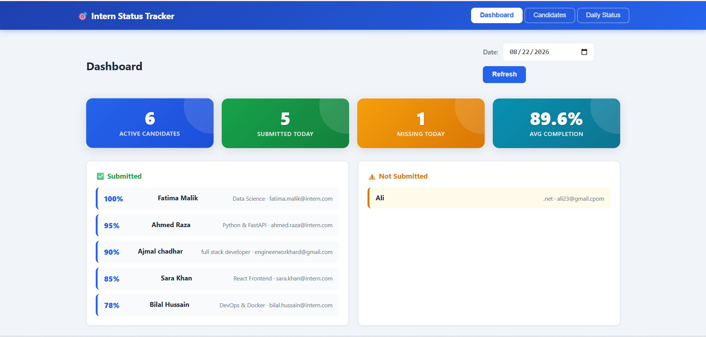

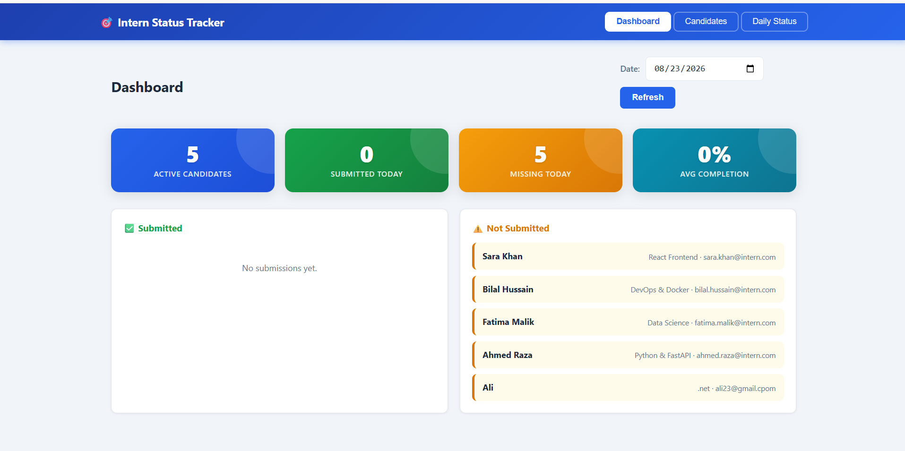

The dashboard provides an overview of active candidates, daily status submissions, missing statuses, average completion percentage, and candidate progress.

### Candidate Management

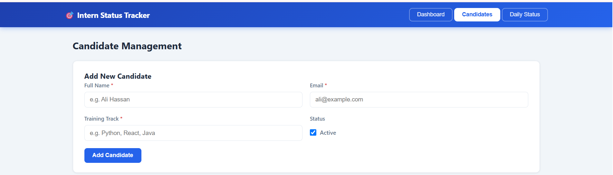

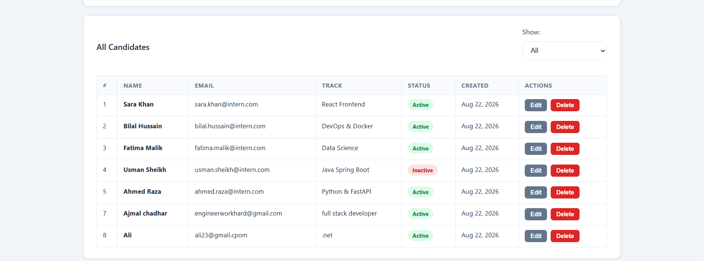

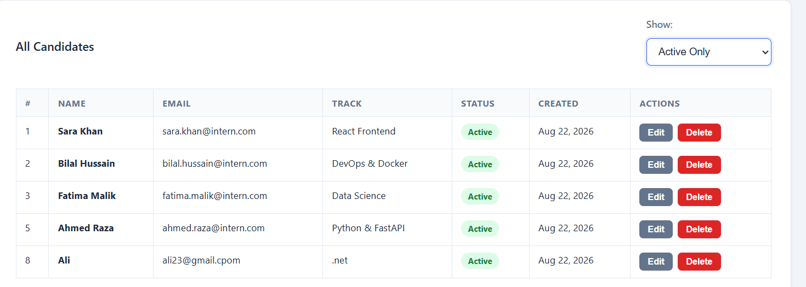

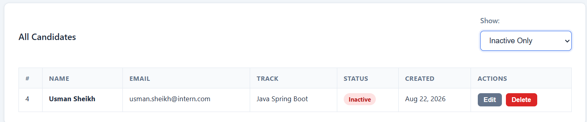

The Candidate Management page allows administrators to add, view, edit, delete, and manage internship candidates.

### Daily Status Management

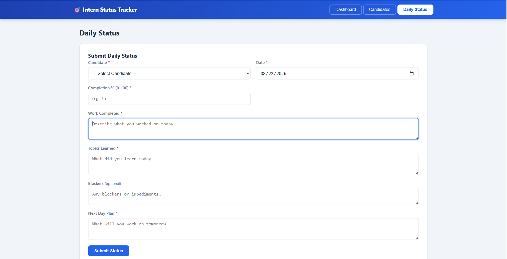

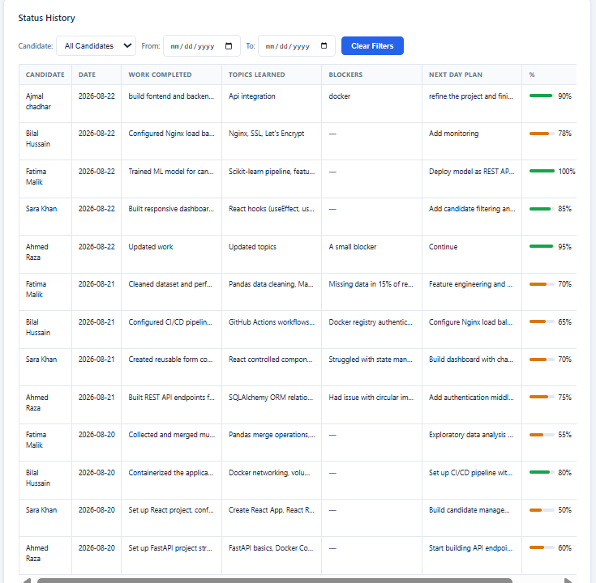

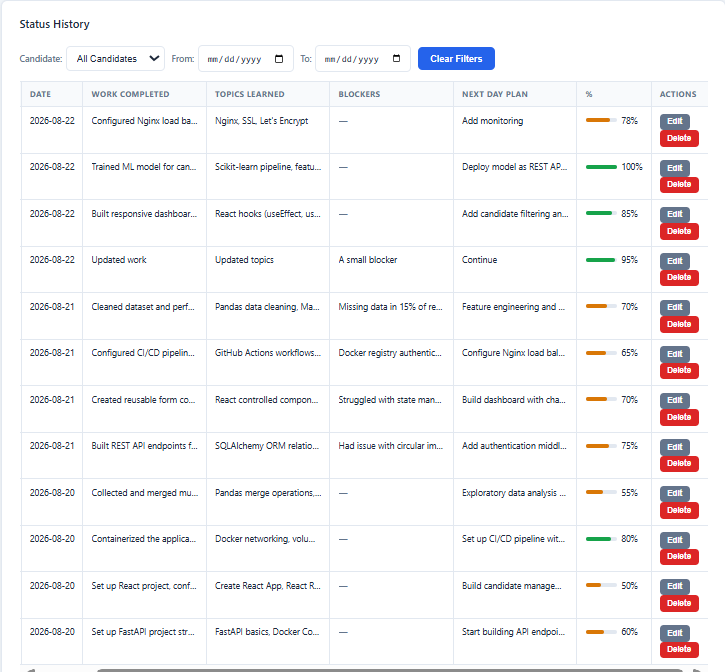

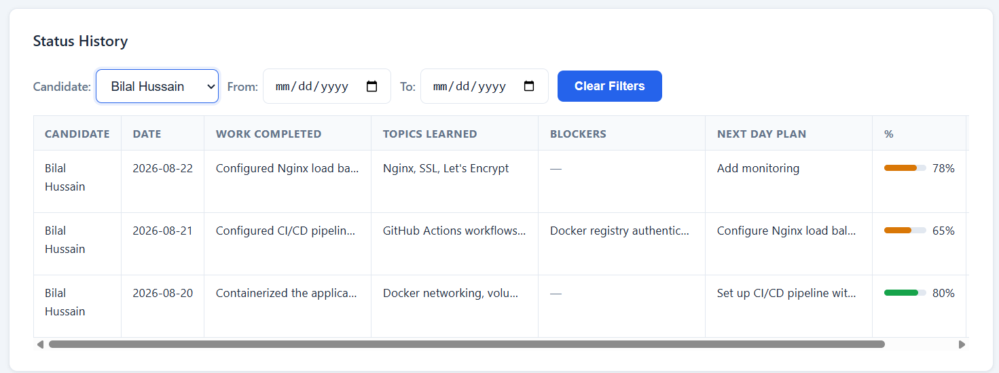

The Daily Status page allows daily work information, topics learned, blockers, next-day plans, and completion percentages to be recorded. The status section provides candidate and date-based filtering.

### Swagger API Documentation

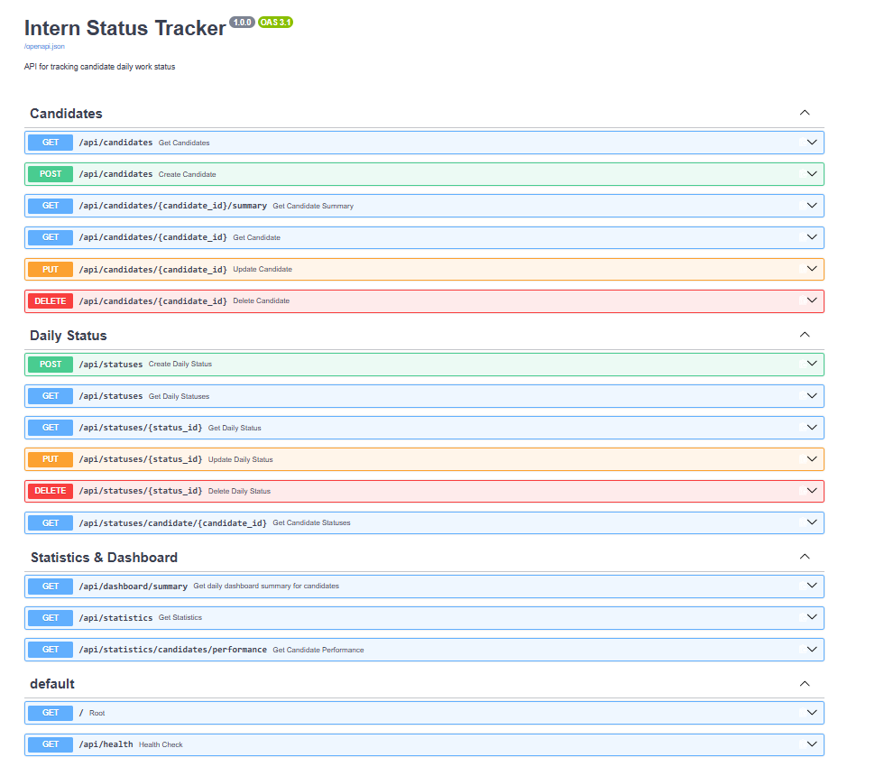

The Swagger UI provides interactive documentation for all FastAPI endpoints.

### Automated Tests

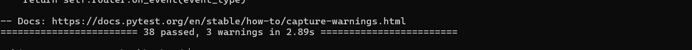

All 38 backend tests passed successfully.
